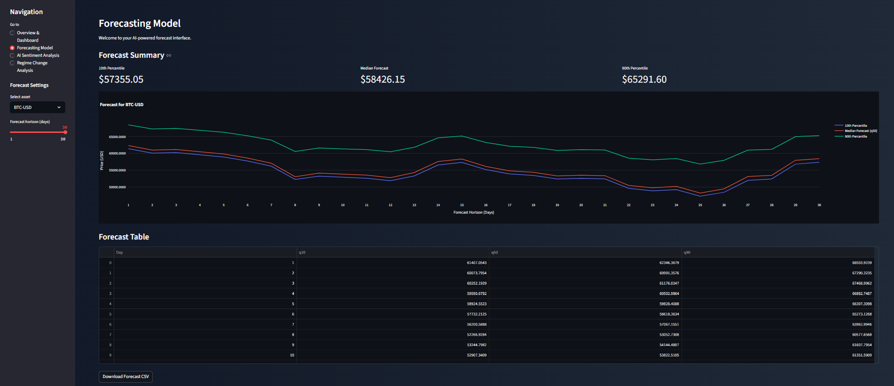
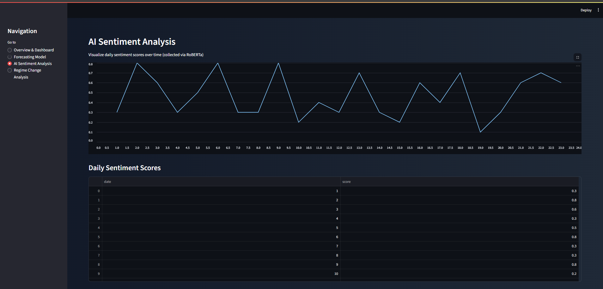
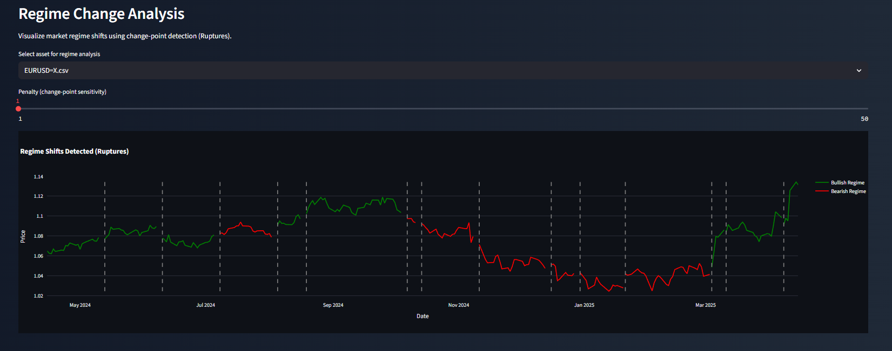

# Quant LSTM Intelligence Suite

A Streamlit application for **financial forecasting, sentiment analysis, and regime detection**.  
This project combines econometrics, deep learning (LSTM), and NLP (RoBERTa) to provide an all-in-one predictive finance dashboard.

## 🚀 Features

### 1. Forecasting Model
- LSTM + Quantile Regression
- Predicts multiple price quantiles (10th, 50th, 90th)
- Interactive horizon slider for short- and medium-term forecasts

### 2. AI Sentiment Analysis
- Daily sentiment scoring with RoBERTa
- Visualizes crowd psychology trends over time
- CSV input for flexible data integration

### 3. Regime Change Analysis
- Uses Ruptures for structural break / change-point detection
- Identifies bullish vs. bearish phases
- Interactive penalty slider for sensitivity

## 📂 Project Structure

```
Quant-LSTM/
├── app/                  # Streamlit app (main.py - entry point)
├── forecast_outputs/     # JSON forecast files by asset
├── models/               # trained models / checkpoints
├── NLP sentiment/        # sentiment analysis CSV data
├── Regime Analysis/      # regime detection scripts and data
├── yf data/             # Yahoo Finance historical price data (CSV)
├── requirements.txt      # Python dependencies
├── README.md            # this file
└── .gitignore           # ignore sensitive data, venv, cache
```

## ⚙️ Installation

1. **Clone the repository:**
   ```bash
   git clone https://github.com/yourusername/Quant-LSTM.git
   cd Quant-LSTM
   ```

2. **Create and activate a virtual environment:**
   ```bash
   python -m venv .venv
   
   # Windows
   .venv\Scripts\activate
   
   # Mac/Linux
   source .venv/bin/activate
   ```

3. **Install dependencies:**
   ```bash
   pip install -r requirements.txt
   ```

## ▶️ Usage

**Run the Streamlit app:**
```bash
python -m streamlit run app/main.py
```

The app will open in your browser at `http://localhost:8501`.

## 🧾 Requirements

**Main packages:**
- streamlit
- pandas
- numpy
- plotly
- scikit-learn
- ruptures

Full list is in `requirements.txt`.

4. **Run the app and explore the four main sections:**
   - Overview & Dashboard
   - Forecasting Model  
   - AI Sentiment Analysis
   - Regime Change Analysis

## 🛠 Development

- Main Streamlit application (`app/main.py`)
- Forecast data in JSON format (`forecast_outputs/`)
- Sentiment analysis CSV data (`NLP sentiment/`)
- Historical price data from Yahoo Finance (`yf data/`)
- Regime detection using Ruptures library

**Key Features:**
- Dark theme with gradient background
- Interactive sidebar navigation
- Real-time data visualization with Plotly
- Downloadable forecast data
- Multi-asset support (BTC-USD, ETH-USD, EURUSD=X)

Contributions welcome! Open an issue or submit a PR.


## 📸 Screenshots


### Forecasting Model

*LSTM + Quantile Regression with interactive horizon slider*

### AI Sentiment Analysis

*Daily sentiment scores using RoBERTa*

### Regime Change Analysis

*Change-point detection with colored trend lines*


## 📜 License

MIT License — free to use and modify.

## ✨ Author

**Developed by Francisco Cardoso**  
MSc in Mathematics Economics, University of Copenhagen
